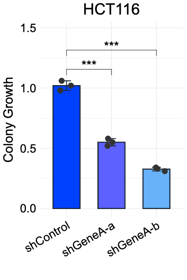
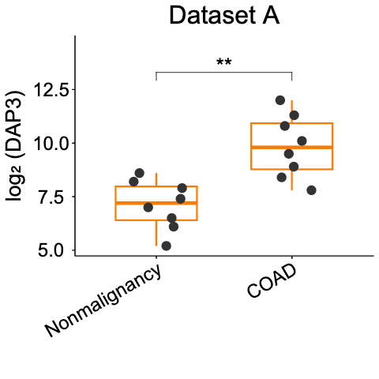
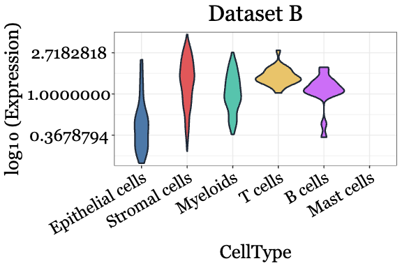
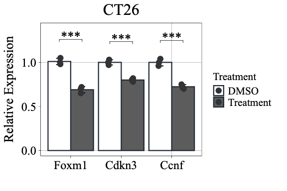
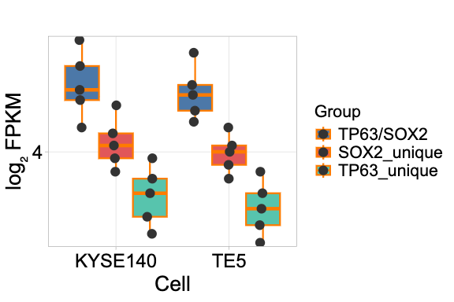
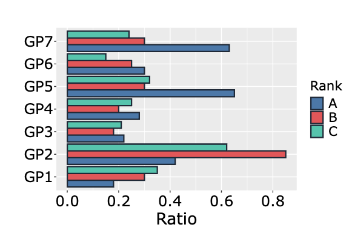
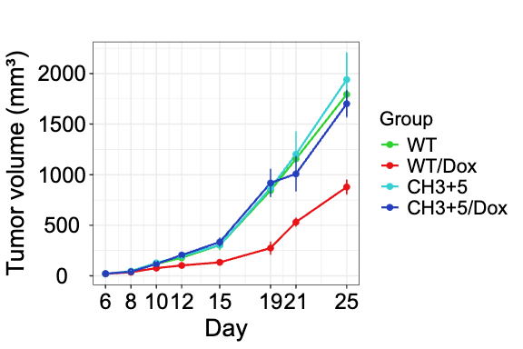
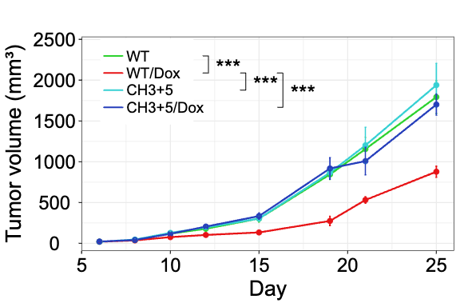
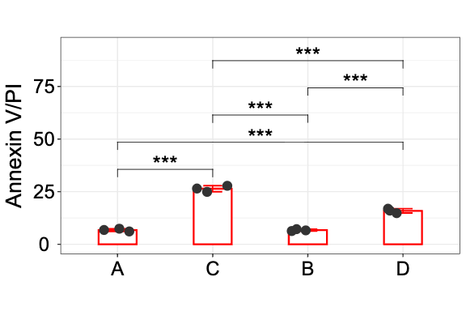
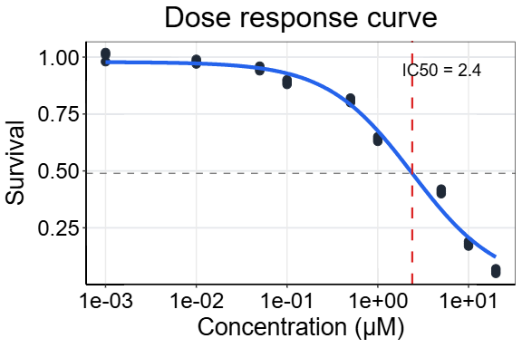

# Figra

**Publication-Quality Scientific Figures from Excel Data**

Figra is an Excel Office Add-in that creates publication-ready scientific visualizations using R and ggplot2 — directly in your browser, with no R installation required.

[-green.svg)](https://h20gg702.github.io/figra-pages/)

---

## Installation

1. Open Excel
2. Go to **Insert** > **Add-ins** > **Get Add-ins**
3. Search for **Figra**
4. Click **Add**

Or sideload the manifest manually for testing — see the [support page](https://h20gg702.github.io/figra-pages/support.html) for instructions.

---

## Quick Start

1. **Select your data** in Excel (with headers)
2. **Click "Select your data in Excel and click here to load"** in the Figra panel
3. **Choose a chart type** from the dropdown
4. **Map your columns** (Group, X, Y, Error as needed)
5. **Customize** colors, fonts, and themes across the 5 tabs
6. **Click "Preview"** to see your figure
7. **Click "Insert Figure"** to add it to your sheet

---

## Features

- **18+ chart types** — bar, box, violin, dot, line, grouped variants, IC50 dose-response
- **Built-in statistical analysis** — t-test, ANOVA, Kruskal-Wallis, Wilcoxon, with post-hoc tests (Tukey, Bonferroni, Dunnett)
- **Significance markers** — brackets with *, **, *** or p-values, automatically placed
- **R code export** — generates ggplot2 code that reproduces your exact figure
- **Full customization** — fonts, colors, themes, axis scales, labels
- **Data Table Converter** — converts wide-format Excel data to long format for plotting
- **Regenerate from PNG** — reload all settings from a previously inserted figure
- **No installation of R required** — runs entirely in your browser via WebAssembly

---

## Chart Examples

### Bar & Box Charts

| Bar + Error + Dots | Box Plot + Dots | Violin Plot + Dots |
|:------------------:|:---------------:|:-----------------:|
|  |  |  |

### Grouped Charts

| Grouped Bar + Error + Dots | Grouped Box + Dots | Horizontal Grouped Bar |
|:--------------------------:|:-----------------:|:---------------------:|
|  |  |  |

### Line Charts & Statistical Legends

| Grouped Line + Error | Grouped Line + Statistical Legend |
|:--------------------:|:---------------------------------:|
|  |  |

### Multiple Comparisons & Dose-Response

| Multiple Comparisons | IC50 Dose-Response (4PL) |
|:--------------------:|:------------------------:|
|  |  |

---

## Statistical Analysis

Figra automatically performs appropriate statistical tests based on your data:

| Groups | Normal Data | Non-normal Data |
|--------|-------------|-----------------|
| 2 | t-test / Welch's | Wilcoxon |
| 3+ | ANOVA + post-hoc | Kruskal-Wallis + Dunn |

**Post-hoc tests:** Tukey HSD, Bonferroni, Holm, Dunnett, Dunn

**Result display options:**
- Brackets with stars (*, **, ***) directly on the figure
- Letters (a, b, c) for compact display
- Exact p-values
- VBracket legend for grouped line plots (3+ groups)
- Export statistics table to Excel cells

---

## Supported Data Formats

| Chart Type | Required Columns |
|------------|------------------|
| Histogram | Values |
| Box / Violin / Dot | Category, Values |
| Bar + Error | Category, Mean, Error |
| Bar + Error + Dots | Category, Values (raw) |
| Grouped charts | Group, Category, Values |
| Grouped Line + Error (raw) | Group, X, Values (stats calculated automatically) |
| IC50 Dose-Response | Concentration, Response |

---

## How It Works

Figra uses [webR](https://webr.r-wasm.org/) to run R code directly in your browser via WebAssembly:

- **No R installation required** — runs entirely client-side
- **No server** — all processing happens locally, data never leaves your computer
- **Cross-platform** — works on Windows, Mac, and Excel Online
- **Reproducible** — export ggplot2 R code to recreate figures anywhere

---

## Technologies

- [Office.js](https://docs.microsoft.com/en-us/office/dev/add-ins/) — Excel JavaScript API
- [webR](https://webr.r-wasm.org/) — R compiled to WebAssembly
- [ggplot2](https://ggplot2.tidyverse.org/) — Grammar of graphics for R
- [svglite](https://svglite.r-lib.org/) — SVG output from R
- [canvg](https://github.com/canvg/canvg) — SVG to Canvas conversion

---

## Author

**Yoshiaki Sato**
ORCID: [0000-0003-3375-5189](https://orcid.org/0000-0003-3375-5189)

## License

MIT License

---

**Figra** — From Data to Publication-Ready Figures
